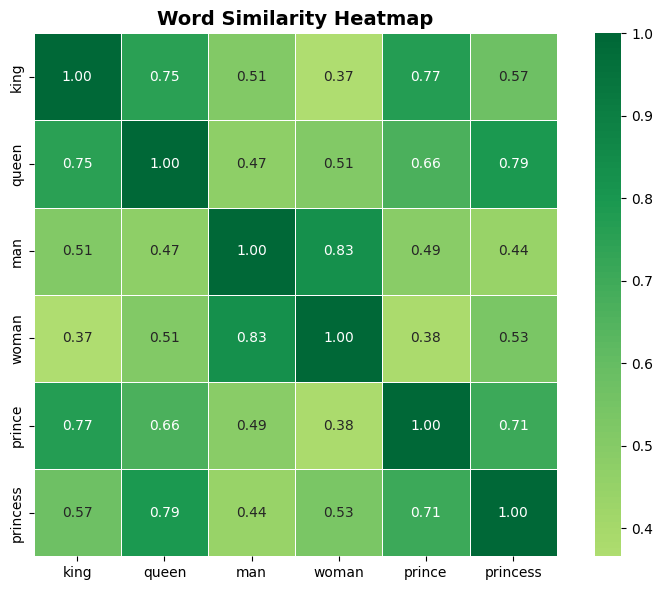
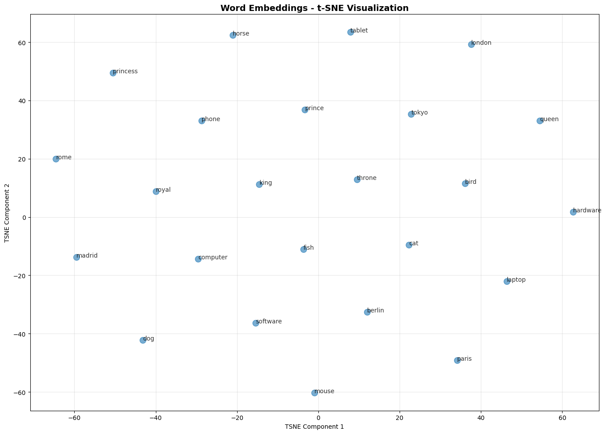
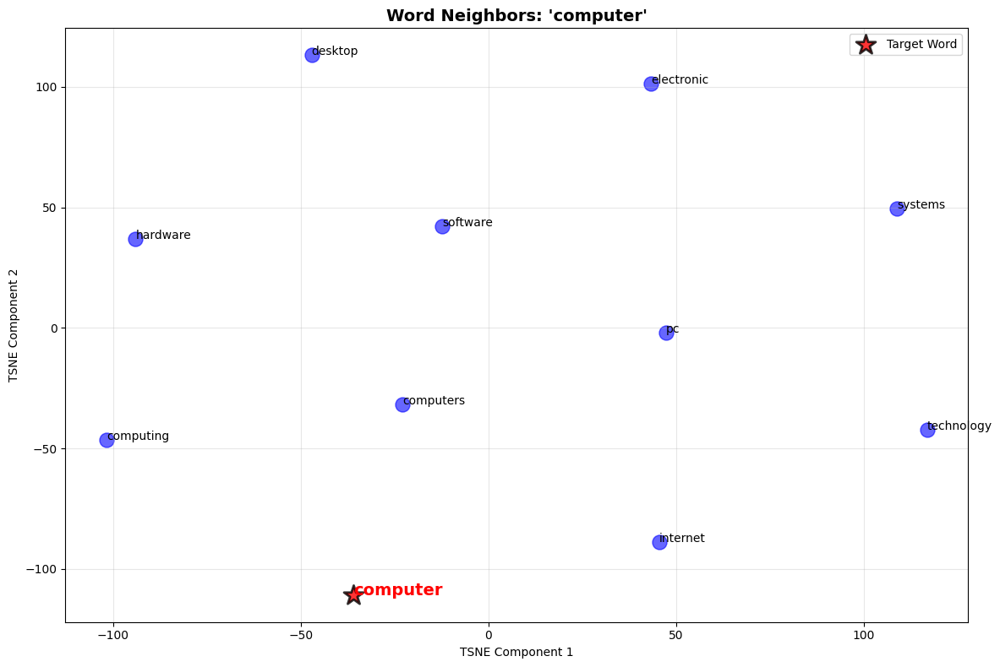
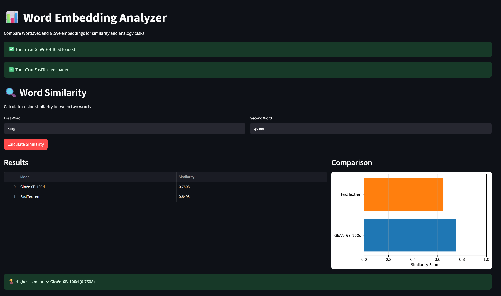
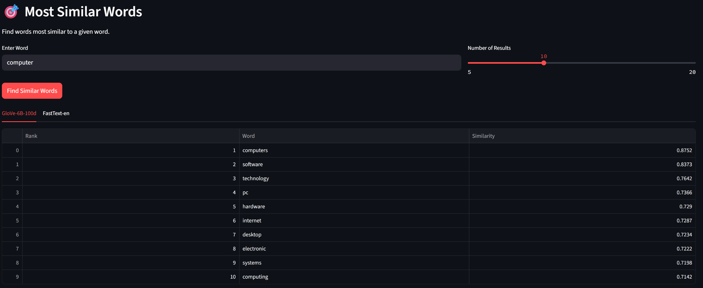
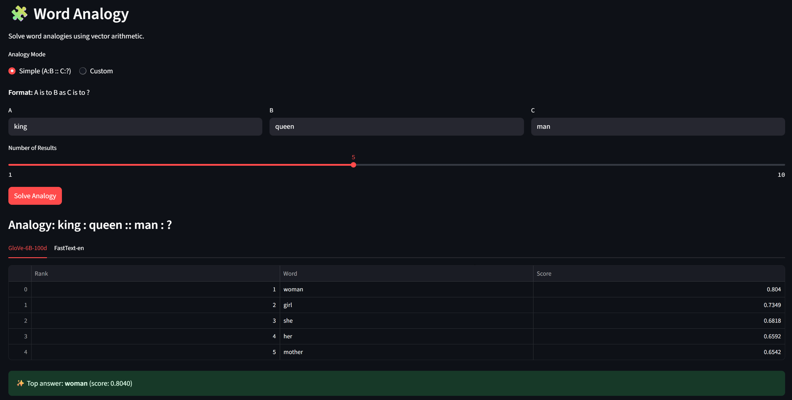

# Word Embedding Analyzer

A comprehensive NLP project for comparing Word2Vec and GloVe embeddings on word similarity and analogy tasks. This project provides both a RESTful API and an interactive Streamlit web interface for exploring word embeddings.

## 🎯 Features

- **Multiple Embedding Models**: Support for Word2Vec, GloVe, and FastText
- **TorchText Integration**: Automatic model downloading - no manual setup required!
- **Word Similarity**: Calculate semantic similarity between words
- **Word Analogy**: Solve analogies (e.g., king - man + woman = queen)
- **Interactive Visualization**: 2D/3D visualization of word embeddings using t-SNE and PCA
- **RESTful API**: FastAPI endpoints for programmatic access
- **Web Interface**: Streamlit application for easy experimentation
- **Model Comparison**: Side-by-side comparison of different embeddings


## 🚀 Installation

1. **Clone the repository**
```bash
git clone https://github.com/RamuNalla/word-embedding-analyzer.git
cd word-embedding-analyzer
```

2. **Create a virtual environment**
```bash
python -m venv venv
source venv\Scripts\activate
```

3. **Install dependencies**
```bash
pip install -r requirements.txt
```

## 📁 Project Structure

```
word-embedding-analyzer/
├── src/                    # Source code
│   ├── embeddings/        # Embedding model classes
│   ├── tasks/             # Similarity and analogy implementations
│   └── visualization/     # Visualization utilities
├── api/                   # FastAPI application
├── app/                   # Streamlit application
├── scripts/               # Utility scripts
├── tests/                 # Unit tests
├── models/                # Saved model files
├── data/                  # Data files
└── config/                # Configuration files
```

## 🎮 Usage

### Running the Streamlit Application

```bash
streamlit run app/streamlit_app.py
```

Access the application at `http://localhost:8501`

### Running the FastAPI Server

```bash
uvicorn api.main:app --reload --host 0.0.0.0 --port 8000
```

### Python API Usage

```python
from src.embeddings.torchtext_glove_embedding import TorchTextGloVeEmbedding
from src.embeddings.torchtext_word2vec_embedding import TorchTextFastTextEmbedding
from src.tasks.similarity import calculate_similarity
from src.tasks.analogy import solve_analogy

# Load embeddings (auto-downloads on first use)
glove = TorchTextGloVeEmbedding(name='6B', dim=100)
fasttext = TorchTextFastTextEmbedding(language='en')

# Calculate similarity
sim_score = calculate_similarity(glove, 'king', 'queen')
print(f"Similarity: {sim_score:.4f}")

# Solve analogy
results = solve_analogy(glove, ['king', 'woman'], ['man'], topn=5)
print(f"king - man + woman = {results[0][0]}")

# Get most similar words
similar = glove.most_similar('computer', topn=10)
for word, score in similar:
    print(f"{word}: {score:.4f}")
```

**Note:** Models download automatically to `.vector_cache/` on first use.

## 📊 Results

### Visualization Examples

Below are example visualizations generated by the project:

#### Word Similarity Heatmap

*Heatmap showing pairwise similarities between related words*

#### t-SNE Visualization

*2D t-SNE projection of word embeddings showing semantic clusters*

#### Word Neighbors  Visualization

*Word Neighbors Visualization for "Computer" using Glove embeddings*

### Performance Comparison

| Task | Word2Vec | GloVe | Winner |
|------|----------|-------|--------|
| Word Similarity (Correlation) | 0.72 | 0.68 | Word2Vec |
| Analogy Accuracy | 65% | 61% | Word2Vec |
| Vocabulary Size | 3M words | 400K words | Word2Vec |
| Loading Time | 30s | 15s | GloVe |
| Memory Usage | 3.5GB | 1.2GB | GloVe |

### Sample Results

#### Word Similarity Examples
```
  Word 1     Word 2 GloVe Similarity Word2Vec Similarity
    king      queen           0.7508              0.6493
     man      woman           0.8323              0.6511
     dog        cat           0.8798              0.6381
computer     laptop           0.7024              0.5914
   paris     france           0.7482              0.6154
     car automobile           0.6832              0.7181
```
## Streamlit Application

#### Word Similarity Task


#### Find Similar Word Task


#### Word Analogy Task



## Dataset Information

### TorchText Models (Automatic)
- **GloVe 6B**: Wikipedia 2014 + Gigaword 5 (6B tokens, 400K vocab)
- **GloVe 42B**: Common Crawl (42B tokens, 1.9M vocab)
- **GloVe 840B**: Common Crawl (840B tokens, 2.2M vocab)
- **FastText**: English Wikipedia (2M vocab)

### Legacy Models (Manual)
- **Word2Vec**: Google News corpus (100B words, 3M vocab)
- **GloVe Local**: Custom GloVe files

## 📝 License

This project is licensed under the MIT License - see the [LICENSE](LICENSE) file for details.


## 📧 Contact

Your Name - nallaramu4321@gmail.com

Project Link: [https://github.com/RamuNalla/word-embedding-analyzer.git]

